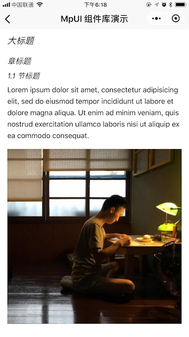

Article
===

文章

## 使用

```vue
<template>
  <ui-article :content="content" />
</teamplate>

<script>
import uiArticle from 'weui-mpvue/components/article'

export default {
  components: {
    uiArticle
  },

  data () {
    return {
      content: `# 大标题

## 章标题

### 1.1 节标题

Lorem ipsum dolor sit amet, consectetur adipisicing elit, sed do eiusmod tempor incididunt ut labore et dolore magna aliqua. Ut enim ad minim veniam, quis nostrud exercitation ullamco laboris nisi ut aliquip ex ea commodo consequat.


`
    }
  }
}
</script>

<style>
/* 自定义文章样式 */
.mpui-article__h1,
.mpui-article__h2,
.mpui-article__h3 {
  font-weight: bold;
  font-style: italic;
}
</style>
```

## 属性

| 属性 | 类型 | 默认值 | 说明 |
| :-- | :-- | :-- | :-- |
| content | String |   | 文章内容，支持 Markdown 格式 |
| styles | Object |   | 组件样式（mpvue 暂时不支持组件的 `style`） |

## 样式

自定义文章段落样式，样式定义格式：`.mpui-articel__TAG`，`TAG` 是 Markdown 转换后的 HTML 标签。

## 预览


